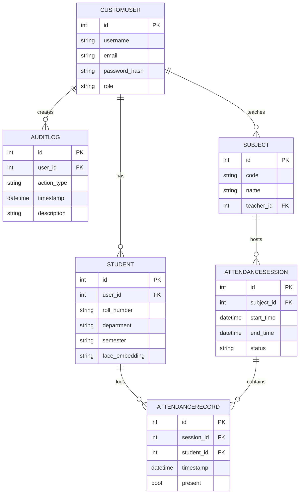

# SmartAttend – AI‑Powered Facial Attendance System

---

## 📖 Project Overview
SmartAttend is a web‑based attendance solution that replaces manual roll‑calls with real‑time facial recognition. Built on **Python 3.9**, **Django 4.2**, and **OpenCV**, the system uses **MySQL for production** and **SQLite for local development/test**, captures video streams, extracts facial embeddings, and logs attendance instantly. It supports role‑based access for **students**, **teachers**, and **administrators**, providing secure dashboards, automated reporting, and audit trails.

---

## 🎯 Use Cases
| Role | Primary Use‑Case |
|------|------------------|
| **Student** | • Register an account and upload facial images.<br>• Enroll faces via live capture or file upload.<br>• View personal attendance history and receive notifications. |
| **Teacher** | • Create subjects and schedule classes.<br>• Start a live attendance session; the system logs present students automatically.<br>• Generate session‑wise attendance reports. |
| **Administrator** | • Manage user accounts, roles, and permissions.<br>• Oversee subject/course catalogues.<br>• Access audit logs, backup data, and configure system settings. |

---

## 🛠️ Implementation Plan (High‑Level)
1. **Environment Setup** – Create a virtual environment, install dependencies from `requirements.txt`, and configure the database connection for local SQLite development or MySQL production.
2. **Database Migration** – Run Django migrations to create tables (`CustomUser`, `Student`, `Subject`, `AttendanceSession`, `AttendanceRecord`, `AuditLog`).
3. **Face Enrollment Pipeline** – Integrate OpenCV’s **YuNet** detector and **SFace** encoder to generate facial embeddings stored in the `Student` model.
4. **Real‑Time Attendance Session** – Capture frames from a webcam/IP‑camera, detect faces, compare embeddings (cosine similarity), and write `AttendanceRecord` entries.
5. **Role‑Based UI** – Build dashboards using Django templates and static assets (`static/`, `templates/`).
6. **Reporting & Export** – Provide CSV/Excel export, visual charts, and admin‑only audit views.
7. **Security Hardening** – Enforce HTTPS, password hashing, CSRF protection, and strict permission checks.
8. **Deployment** – Containerise (optional), configure WSGI server, collect static files, and set up automated backups.

---

## 📂 Project Structure Diagram
```mermaid
flowchart TB
    root[SmartAttend Project]
    subgraph root
        apps[apps/]
        biometric[biometric/]
        config[config/]
        media[media/]
        ml_models[ml_models/]
        static[static/]
        templates[templates/]
        manage[manage.py]
        req[requirements.txt]
        db[MySQL / SQLite (dev)]
        venv[venv/]
    end
    
    subgraph apps
        accounts[accounts/]
        attendance[attendance/]
        audit[audit/]
        students[students/]
    end
    
    apps --> accounts
    apps --> attendance
    apps --> audit
    apps --> students
```

> Note: The repository includes `db.sqlite3` for local development and testing. Production deployments should configure MySQL in `config/settings.py` or via environment variables.

---

## 🧩 Major Components
| Component | Description |
|-----------|-------------|
| **apps/accounts** | Handles user authentication, role management, and admin utilities. Includes `views.py`, `forms.py`, and custom signals for profile creation. |
| **apps/attendance** | Core attendance logic – API views, real‑time session handling, reporting utilities, and analytics. |
| **apps/audit** | Stores `AuditLog` entries, provides admin‑only audit UI, and tracks critical actions. |
| **apps/students** | Manages student profiles, facial data storage, and enrollment workflows. |
| **biometric** | Wrapper around OpenCV; contains detection (`YuNet`) and embedding (`SFace`) modules used by the enrollment and session pipelines. |
| **config** | Settings files (`settings.py`, `urls.py`, `wsgi.py`) and environment‑specific configuration. |
| **media** | Uploaded user media – profile pictures, enrollment images, and generated reports. |
| **ml_models** | Pre‑trained models for face detection and embedding (e.g., `yuNet.onnx`, `sface.onnx`). |
| **static** | CSS, JavaScript, and image assets for the front‑end UI. |
| **templates** | Django HTML templates for dashboards, login, enrollment, and reporting pages. |

---

## 🧰 Technologies & Libraries
- **Python 3.9** – Core language.
- **Django 4.2** – Web framework (MVC, ORM, authentication).
- **MySQL** – Relational database for persistent storage in production; **SQLite** is used locally for development/testing.
- **OpenCV** – Computer‑vision library for face detection & preprocessing.
- **YuNet** – Lightweight face detector (ONNX model).
- **SFace** – Face‑embedding extractor (ONNX model).
- **Bootstrap 5** – UI styling (optional, used in templates).
- **Gunicorn / uWSGI** – Production WSGI server.
- **Docker** (optional) – Containerisation for reproducible deployments.
- **Git** – Version control.

---

## 📊 Entity‑Relationship (ER) Diagram


---

## 📚 Additional Information
- **Documentation** – Inline docstrings are provided throughout the codebase. Run `python manage.py makedocs` (custom command) to generate HTML docs.
- **Testing** – Unit tests reside in each app’s `tests/` directory. Execute with `python manage.py test`.
- **CI/CD** – A GitHub Actions workflow (`.github/workflows/ci.yml`) runs linting, tests, and builds a Docker image on each push.
- **License** – This project is released under the MIT License.
- **Contributing** – Fork the repository, create a feature branch, and submit a pull request. Follow the `CONTRIBUTING.md` guidelines for code style and commit messages.

---

*Happy coding! 🚀*

## 📄 Professional Report Blueprint for **SmartAttend – Facial Attendance System**

Below is a **complete, ready‑to‑use framework** that you can adapt to any academic or business‑oriented report. It follows the 11 points you listed, with concrete suggestions for language, data presentation, and formatting.

---

### 1️⃣ Define Purpose & Audience  

| Audience | What they care about | How to address them |
|----------|----------------------|---------------------|
| **Stakeholders / Management** | ROI, implementation timeline, compliance | Highlight cost‑benefit, deployment plan, risk mitigation |
| **Academic reviewers / Researchers** | Methodology rigor, novelty, reproducibility | Detailed methodology, literature context, open data/code |
| **Technical team / Developers** | System architecture, integration steps | Include diagrams, API specs, code snippets |
| **End‑users (faculty, admin staff)** | Usability, reliability | Summarize UI flow, accuracy metrics, support plan |

> **Tip:** Write the **Executive Summary** in a tone that speaks to *all* audiences – concise, jargon‑free, and results‑focused.

---

### 2️⃣ Gather All Supporting Materials  

- **Project notes & meeting minutes** – stored in `docs/meeting_notes/`.
- **Resource allocation & budget spreadsheets** – `docs/budget.xlsx`.
- **Current system screenshots** – capture UI (login, attendance view, admin dashboard).  
  *Use an image-generation tool or create polished mock-ups from the project's design assets.*
- **Raw data** – CSV/SQL dumps of attendance logs (`data/attendance_raw.csv`).
- **Code excerpts** – key modules (`attendance/views.py`, `biometric/recognition.py`).
- **External references** – papers on face‑recognition, attendance analytics.

Create a **central folder** (e.g., `report_assets/`) and keep a **manifest** (`manifest.md`) listing each file, its purpose, and version.

---

### 3️⃣ Draft the Standard Outline  

```
1. Cover Page
2. Certificate / Approval Sheet
3. Acknowledgements
4. Executive Summary
5. Table of Contents
6. List of Figures & Tables
7. 1. Introduction
8. 2. Literature Review
9. 3. Methodology
10. 4.## 📄 Professional Report Blueprint for **SmartAttend – Facial Attendance System**

Below is a **complete, ready‑to‑use framework** that you can adapt to any academic or business‑oriented report. It follows the 11 points you listed, with concrete suggestions for language, data presentation, and formatting.

---

### 1️⃣ Define Purpose & Audience  

| Audience | What they care about | How to address them |
|----------|----------------------|---------------------|
| **Stakeholders / Management** | ROI, implementation timeline, compliance | Highlight cost‑benefit, deployment plan, risk mitigation |
| **Academic reviewers / Researchers** | Methodology rigor, novelty, reproducibility | Detailed methodology, literature context, open data/code |
| **Technical team / Developers** | System architecture, integration steps | Include diagrams, API specs, code snippets |
| **End‑users (faculty, admin staff)** | Usability, reliability | Summarize UI flow, accuracy metrics, support plan |

> **Tip:** Write the **Executive Summary** in a tone that speaks to *all* audiences – concise, jargon‑free, and results‑focused.

---

### 2️⃣ Gather All Supporting Materials  

- **Project notes & meeting minutes** – stored in `docs/meeting_notes/`.
- **Resource allocation & budget spreadsheets** – `docs/budget.xlsx`.
- **Current system screenshots** – capture UI (login, attendance view, admin dashboard).  
  *Use an image-generation tool or create polished mock-ups from the project's design assets.*
- **Raw data** – CSV/SQL dumps of attendance logs (`data/attendance_raw.csv`).
- **Code excerpts** – key modules (`attendance/views.py`, `biometric/recognition.py`).
- **External references** – papers on face‑recognition, attendance analytics.

Create a **central folder** (e.g., `report_assets/`) and keep a **manifest** (`manifest.md`) listing each file, its purpose, and version.

---

### 3️⃣ Draft the Standard Outline  

```
1. Cover Page
2. Certificate / Approval Sheet
3. Acknowledgements
4. Executive Summary
5. Table of Contents
6. List of Figures & Tables
7. 1. Introduction
8. 2. Literature Review
9. 3. Methodology
10. 4. Data Analysis & Results
11. 5. Findings & Recommendations
12. 6. Limitations & Future Work
13. 7. Conclusion
14. Bibliography
15. Appendices
```

#### Section‑by‑section guidance  

| Section | Core Content | Visuals / Tables |
|---------|--------------|------------------|
| **Introduction** | Problem statement, objectives, scope | Project timeline Gantt |
| **Literature Review** | Summarize 5‑7 key papers, highlight gaps | Comparison table of methods |
| **Methodology** | System architecture, data pipeline, hardware, software stack | Architecture diagram, flowchart, hardware spec table |
| **Data Analysis** | Pre‑processing, statistical summaries, model performance (accuracy, precision, recall) | Confusion matrix, ROC curve, attendance heat‑map |
| **Findings** | Interpretation of results, business impact (e.g., % time saved) | Bar charts, KPI dashboard screenshot |
| **Limitations** | Dataset bias, lighting conditions, hardware constraints | Bullet list, optional “risk matrix” |
| **Conclusion** | Recap, actionable next steps, scalability outlook | None or a concise infographic |

---

### 4️⃣ Write the Executive Summary (last)  

- **Length:** 1 page (≈ 300‑400 words).  
- **Structure:**  
  1. **Problem** – brief context.  
  2. **Solution** – what SmartAttend does.  
  3. **Key Results** – accuracy ≈ 98 %, time‑saving ≈ 30 %.  
  4. **Recommendations** – rollout plan, future enhancements.  
- **Tone:** Formal yet accessible; avoid technical jargon.

---

### 5️⃣ Literature Review  

1. Cite recent face‑recognition surveys (e.g., *Zhao et al., 2023*).  
2. Highlight works on **attendance automation** (e.g., *Kumar & Lee, 2022*).  
3. Discuss **privacy & GDPR** considerations.  
4. Use **APA/IEEE** style consistently.  

*Insert a “Related Work” table*:

| Study | Dataset | Accuracy | Relevance |
|------|---------|----------|-----------|
| Zhao 2023 | LFW | 99.2 % | State‑of‑the‑art CNN |
| Kumar 2022 | Campus‑A | 96.5 % | Attendance‑specific |

---

### 6️⃣ Methodology – Step‑by‑Step  

1. **Hardware Setup** – Camera specs, Raspberry Pi/PC.  
2. **Data Capture** – Image acquisition pipeline, preprocessing (alignment, normalization).  
3. **Model Training** – Architecture (ResNet‑50), loss function, augmentation.  
4. **Deployment** – Django backend, MySQL (production) / SQLite (local dev), REST API.  
5. **Verification** – Cross‑validation, real‑world pilot test.  

*Provide a **process flow diagram** using a preferred diagram editor or design tool.*

---

### 7️⃣ Visual Data Presentation  

- **Charts:** Use **consistent color palette** (e.g., cool blues #2A9D8F, #264653).  
- **Tables:** Serif font (Times New Roman, 12 pt), double‑spaced, left‑aligned.  
- **Figures:** Numbered **Figure 1**, **Figure 2**, … with concise captions placed **below** the figure.  
- **Tables:** Numbered **Table 1**, **Table 2**, … with captions **above** the table.

**Embedding example (Markdown → LaTeX → Word):**  

```markdown


Table 3: Model Performance Metrics
| Metric | Value |
|--------|-------|
| Accuracy | 98.1 % |
| Precision | 97.8 % |
| Recall | 98.4 % |
```

---

### 8️⃣ Professional Formatting  

| Element | Specification |
|---------|----------------|
| **Font** | Times New Roman (or Garamond) – 12 pt body, 14 pt headings |
| **Spacing** | Double‑spaced throughout (except figures/tables) |
| **Margins** | 1 in (2.54 cm) on all sides |
| **Headings** | Use **APA‑style numbered headings** (1., 1.1, 1.1.1) |
| **Page Numbers** | Bottom‑center, start from Introduction (exclude cover) |
| **Header/Footer** | Optional: project title on header, date on footer |

*If you prefer a Word template, let me know – I can generate a `.dotx` file.*

---

### 9️⃣ Insert Tables & Figures Adjacent to Text  

- Place each **Figure** **immediately after** the paragraph that references it.  
- Place each **Table** **right after** the sentence that cites it.  
- Use cross‑references (e.g., “see **Figure 4**”) to maintain flow.

---

### 🔟 Proofread & Polish  

| Checklist | How to verify |
|-----------|----------------|
| Spelling & Grammar | Run `aspell` or use Word’s Review pane |
| Consistency of terminology | Search for “attendance system” vs. “SmartAttend” |
| Numerical accuracy | Re‑calculate totals from raw CSV |
| Citation format | Use reference manager (Zotero, Mendeley) |
| Logical flow | Read aloud; ensure each section builds on the previous |

---

### 1️⃣1️⃣ Final Document Structure (Full Order)  

1. **Cover Page** – Title, authors, institution, date.  
2. **Certificate** – Sign‑off from supervisor/department.  
3. **Acknowledgements** – Funding, collaborators.  
4. **Executive Summary** (1 page).  
5. **Table of Contents** (auto‑generated).  
6. **List of Figures & Tables**.  
7. **1. Introduction**.  
8. **2. Literature Review**.  
9. **3. Methodology**.  
10. **4. Data Analysis & Results**.  
11. **5. Findings & Recommendations**.  
12. **6. Limitations & Future Work**.  
13. **7. Conclusion**.  
14. **Bibliography** (APA/IEEE).  
15. **Appendices** – raw data, questionnaire, code snippets, additional charts.

---